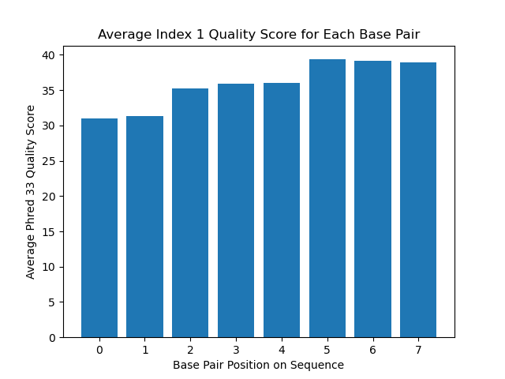
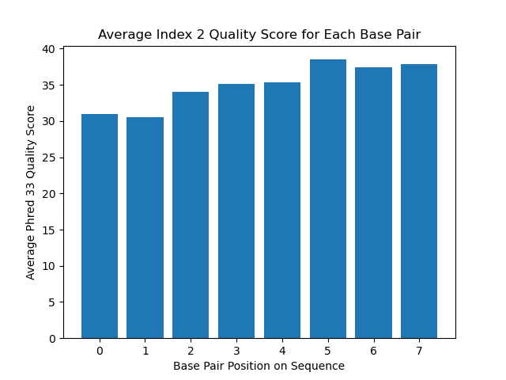
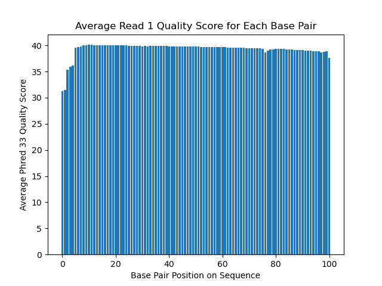
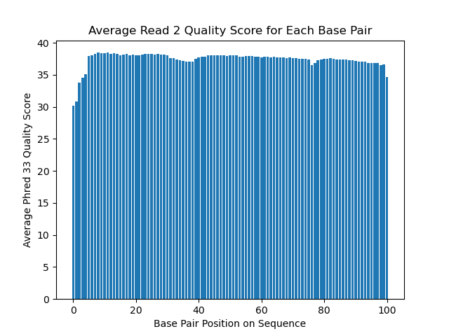

# Assignment the First

## Part 1
1. Be sure to upload your Python script. Provide a (relative, not absolute) link to it here:
phred coding would be 33 or 64

| File name | label | Read length | Phred encoding |
|---|---|---|---|
| 1294_S1_L008_R1_001.fastq.gz |Read 1|101bp|Phred 33|
| 1294_S1_L008_R2_001.fastq.gz |Index 1|8bp|Phred 33|
| 1294_S1_L008_R3_001.fastq.gz |Index 2|8bp|Phred 33|
| 1294_S1_L008_R4_001.fastq.gz |Read 2|101|Phred 33|

2. Per-base NT distribution: Use markdown to insert your 4 histograms here.






3. What is a good quality score cutoff for index reads and biological read pairs to utilize for sample identification and downstream analysis, respectively? Justify your answer.

A quality score of 28 would be a good quality score cut off. When looking at the index graphs, the earlier base pairs in the index have a lower average quality score around 28. If I pick a value over 28 I might miss the majority of the indexes. It is important to keep records with high quality indexes to remain confident that the reads are categorized correctly by the sample they truly originated from. At the same time, if we only selected for quality scores of 40, there would be no data to work with. This trade off is balanced by selecting a quality score cut off of 28. Additionally, for these indexes, it seems like it would take more than 1 base pair change to accidentally misread into a different index. Therefore, for each read that has more than 1 minimum quality score below 28, this will be treated as a condition that we are unconfident to categorize for that index/sample and it will be placed in the "unknown" category. 

4.	How many indexes have undetermined (N) base calls? (Utilize your command line tool knowledge. Submit the command(s) you used. CHALLENGE: use a one-line command)
```bash
zcat 1294_S1_L008_R2_001.fastq.gz | grep -A1 ^"@"| grep -v ^"@" | grep -v ^"-" | grep "N" | wc -l
```
output: 3976613

There are 3,976,613 indexes in the R2 file that have undetermined ("N") base calls.
```bash
zcat 1294_S1_L008_R3_001.fastq.gz | grep -A1 ^"@"| grep -v ^"@" | grep -v ^"-" | grep "N" | wc -l
```
output: 3328051 

There are 3,328,051 indexes in the R3 file that have undetermined ("N") base calls. 

These are 7,304,664 total indexes that have undetermined "N" base calls.

## Part 2

1. Describe input
We have 4 fastq files that are the raw data that have resulted from the library prep (in this case, one performed by the 2017 BGMP cohort). The 4 fastq files include the reads and barcodes (indexes). Reads 1 and 4 contain the insert reads while reads 2 and 3 contain the barcondes for those reads respectively, though read 3 contains the reverse compliment of those barcodes. 

In this plan, I need to de-multiplex the data, meaning that I need to go through the 4 files to find if the forward barcodes and the reverse barcodes match per read. For those that match, thpse are considered  "dual matched". For those that do not match, they must have "hopped". For barcodes that do not match any of our existing barcodes, (those with "N"/undetermined nucleotides), those are "unknown. 

2. Describe output
There are 24 barcodes (indexes) for our data. Those are all listed in the indexes.txt file. We have 2 reads, forward and reverse. For each index, there will be 2 files for all of the reads that were successfully dual matched between the 2 reads. For example, all reads from read 1 with index B1 that were successfully matched with their corresponding read 2 barcode for B1 will be put into one file. Maybe this file can be called B1_R1.fq. Therefore, their corresponding reads from the read 2 file (which is our R4 file), will be in another file maybe called something like B1_R2.fq.

We will do this again for all "hopped" indexed reads; an example would be the 4th record of the read 1 and 2 files have a B1 index for read 1, but a A11 index for R2. These will be stored in files maybe named unmatched_R1.fastq and unmatched_R2.fastq, regardless of their indexes, as these will be added to the headers for each record as they go into the file. This will be repeated again for all unknown files...

All unknown files are going to be reads where one or both of the indexes are not within our list of known read indexes OR the quality of the read is below the threshold. These will go out to only 2 files for each read: unknown_R1.fastq and unknown_R2.fastq. The quality threshold can be better determined once we have graphed the quality distribution of all 4 files.

We will print stats to the terminal including: counts of matched read pairs with their corresponding index, total hopped indexes with their corresponding index pairs, and the total unknown index reads

3. Upload your [4 input FASTQ files](../TEST-input_FASTQ) and your [>=6 expected output FASTQ files](../TEST-output_FASTQ).

Done!

- Include the appropriate number of properly formatted output FASTQ files given your input files:
All files that were written to should have 1 record, except the unknown records. Those should have 2 records. There should be 2 written files for the B1 index, 2 files for the hopped reads, and 2 files for the unknown reads.


## 4. Pseudocode
    1. Open all 4 fastq files for each of the 4 runs
    2. Go through the 4 files record by record
        3. Check if the record is considered "unknown"
            Do the indexes NOT match those that are in our expected list of indexes?
            Is the quality NOT above the established threshold?
                Yes - Mark this record's status as "unknown" and skip the rest of the checks to put it into the designated "unknown" files.
                Increment the unknown counter.
        4. Check if the record is considered "matched" or "hopped"
            Do the indexes match?
                Yes! - then mark this record's status as "matched" and skip the rest of the checks to put it into the designated "matched" files.
                    Increment the matched counter for this index.
                No! - then mark this record's status as "hopped" and skip the rest of the checks to put it into the designated "hopped" files.
                    Increment the hopped counter for this pair of indexes.
    5. Grab the 4 lines of read 1 and the 4 lines of read 2.
    6. Based on their marked status, append the appropriate file with that record
        For example, for matched records, open 2 files for this index to store the read 1 match and read 2 match.
                    for the hopped records, open 2 files for ALL hopped records to store read 1 and read 2.
                    for the unknown records, open 2 files for ALL unmatched records to store read 1 and read 2.
        When these records are being added, the indexes for read 1 and read 2 will be added to the end of each header line.
    7. Print out to the terminal:
        - the number of read-pairs with properly matched indexes (per index-pair)
        - the total number of read pairs with index-hopping observed
        - the number of index-hopping PER each pair of indexes. For example, A swapped with B 7 times, and B swapped with A once.
        - the number of read-pairs with unknown index(es).


5. High level functions. For each function, be sure to include:
    1. Description/doc string
    2. Function headers (name and parameters)
    3. Test examples for individual functions
    4. Return statement
    ```python
    def make_reverse_complement(DNA: str) ->  str:
        ```Takes in a DNA string and returns the reverse complement of that string.```
        return reverse_complement
        Input: CAT
        Output: ATG
    ```
    ```python
    def append_fastq(fq_lines: str, indexes: str, file_name: str):
        ```Take in the 4 fastq record lines and the indexes. Append the header line with the read's corresponding indexes. Then append to the desired file```
        return None
    ```
    Input: fq_lines:
    ```
    "@B1_index_matched_R1:83:HJKJNBBXX:8:1101:1265:1191 1:N:0:1
    AAAAAAAATTCCCAGAGACATCAGTACCCAGTTGGTTCAGACAGTTCCTCTATTGGTTGACAAGGTCTTCATTTCTAGTGATATCAACACGGTGTCTACAA
    +
    IIIIIIIIIIIIIIIIIIIIIIIIIIIIIIIIIIIIIIIIIIIIIIIIIIIIIIIIIIIIIIIIIIIIIIIIIIIIIIIIIIIIIIIIIIIIIIIIIIIII"
    ```
    indexes: AAAAAAAA-AAAAAAAA
    file_name: A_R1.fq

    Output: new record appended to fastq file called A_R1.fq that looks like:
    ```
    @B1_index_matched_R1:83:HJKJNBBXX:8:1101:1265:1191 1:N:0:1 AAAAAAAA-AAAAAAAA
    AAAAAAAATTCCCAGAGACATCAGTACCCAGTTGGTTCAGACAGTTCCTCTATTGGTTGACAAGGTCTTCATTTCTAGTGATATCAACACGGTGTCTACAA
    +
    IIIIIIIIIIIIIIIIIIIIIIIIIIIIIIIIIIIIIIIIIIIIIIIIIIIIIIIIIIIIIIIIIIIIIIIIIIIIIIIIIIIIIIIIIIIIIIIIIIIII
    ```
