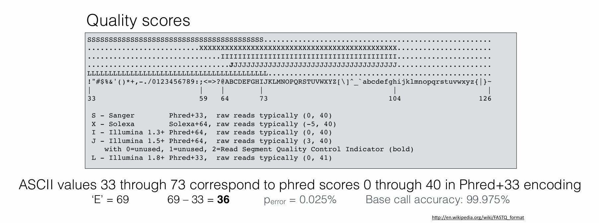

# Demultiplexing Notebook
## Data exploration

all fastq files were found here on talapas: /projects/bgmp/shared/2017_sequencing

| File name | label | Read length | Phred encoding |
|---|---|---|---|
| 1294_S1_L008_R1_001.fastq.gz |Read 1|101bp|Phred 33|
| 1294_S1_L008_R2_001.fastq.gz |Index 1|8bp|Phred 33|
| 1294_S1_L008_R3_001.fastq.gz |Index 2|8bp|Phred 33|
| 1294_S1_L008_R4_001.fastq.gz |Read 2|101bp|Phred 33|

Check the read lengths for each file:
example - Read 4 file
```
 zcat 1294_S1_L008_R4_001.fastq.gz | head -2 | tail -1 | wc
 ```
Output: 102 characters, but 1 character is a new line character so 101bp

Check Phred encoding:
All files contain "#" as a quality score characters, which is exclusive to phred 33.

However, I also noticed that several reads at the beginning of the file had quality scores that start with "#", which is a really low quality score for phred 33...

Loked later in the file to see if scores seem to improve:
```
zcat 1294_S1_L008_R4_001.fastq.gz | head -1000000 | tail -12
```
Here are some of the quality scores with that first character improved:
```
AAFAFJJJJJJJJJJJJFFFJJFFJJJJJJJJAJFJFJJFJJJJJJJJJJJJJJJJJJJJFFJJJJJJJJJJ7-FJJJJJJJJJJJJJJJJJJJJJJJJJJ

<A-A----<---<---------F----<---<--7--<-<--7<------7-----7----77--------7--<-7A<F---7--7--77A-7-7---77

AAAFFAFJJFFAFJAFJF-F<FJJJJJJJJJJJJFFJAJFFFJJJJJJJJJJJJJJJJJFFJJJJJFJJJJJJJAJJJJJJJJJJFFJJJFJJJJJFFJJJ
```

## Make quality score distributions
Histograms can be found here:
1. [Link to Index 1 histogram](/projects/bgmp/mlscha/bioinfo/Bi622/Demultiplex/Assignment-the-first/Index1_dist.png)
2. [Link to Index 2 histogram](Assignment-the-first/Index2_dist.png)
3. [Link to Read 1 histogram](/projects/bgmp/mlscha/bioinfo/Bi622/Demultiplex/Assignment-the-first/Read1_dist.png)
4. [Link to Read 2 histogram](/projects/bgmp/mlscha/bioinfo/Bi622/Demultiplex/Assignment-the-first/Read2_dist.png)

Python script can be found here: /projects/bgmp/mlscha/bioinfo/Bi622/Demultiplex/qscoreDiff.py

Shell script can be found here: /projects/bgmp/mlscha/bioinfo/Bi622/Demultiplex/sbatch_qscorediff.sh

Time and Storage Metrics for qscoreDiff.py
```
Command being timed: "./qscoreDiff.py"
	Percent of CPU this job got: 99%
	Elapsed (wall clock) time (h:mm:ss or m:ss): 2:29:24
	Maximum resident set size (kbytes): 67624
	Exit status: 0
```
Picking a quality score cutoff for the indexes:

A quality score of 29 would be a good quality score cut off. When looking at the index graphs, the earlier base pairs in the index have a lower average quality score around 30. If I pick a value over 30 I might miss the majority of the indexes, but selecting less than 32 might result in keeping low quality data that we cannot be as confident in. 

When looking at the known indexes, none of the indexes seem to be so similar that one base pair misread could accidentally lead to an incorrect index call. That would take more than one index base pair misread. Therefore, if more than 1 index quality score is below 29, these should be considered unknown. 

Additionally, I also want to check if the read quality is good enough to confidentally. Similarly to before, if more than 10% of bases are unconfident, they should be considered unknown. Therefore, if more than 10% of bases have a quality score of less than 29, these should aslo be considered unknown.

## Write Demultiplexing Script
Need to change my script idea to include opening all 52 files and leaving them open as I write into them.

Changed to handle poor quality scores differently.
For indexes, if there is more than 1 qscore below the threshold, consider it that read unknown.
For reads, if there are more than 10% of bases with the quality score below the threshold, consider that read unknown.

Changed code so that these won't be checked until after the index is checked to be seen in the dictionary. 

Writes out to all test files and matches expected files? - Yes!
``` bash
diff -s ../TEST-output_FASTQ/expected_B1_R1_matched_test.fq B1_R1.fq
Output: Files ../TEST-output_FASTQ/expected_B1_R1_matched_test.fq and B1_R1.fq are identical
diff -s ../TEST-output_FASTQ/expected_B1_R2_matched_test.fq B1_R2.fq
Output: Files ../TEST-output_FASTQ/expected_B1_R2_matched_test.fq and B1_R2.fq are identical
diff -s ../TEST-output_FASTQ/expected_hopped_R1_test.fq hopped_R1.fq
Output: Files ../TEST-output_FASTQ/expected_hopped_R1_test.fq and hopped_R1.fq are identical
diff -s ../TEST-output_FASTQ/expected_hopped_R2_test.fq hopped_R2.fq
Output: Files ../TEST-output_FASTQ/expected_hopped_R2_test.fq and hopped_R2.fq are identical
diff -s ../TEST-output_FASTQ/expected_unknown_R1_test.fq unknown_R1.fq 
Output: Files ../TEST-output_FASTQ/expected_unknown_R1_test.fq and unknown_R1.fq are identical
diff -s ../TEST-output_FASTQ/expected_unknown_R2_test.fq unknown_R2.fq 
Output: Files ../TEST-output_FASTQ/expected_unknown_R2_test.fq and unknown_R2.fq are identical
```

Then add output --done!

Then add argparse --done!

Then clean up unused comments - done!

## Run on real data
Then run on real data? - making the slurm script...
```bash
-r1 "/projects/bgmp/shared/2017_sequencing/1294_S1_L008_R1_001.fastq.gz" \
-r2 "/projects/bgmp/shared/2017_sequencing/1294_S1_L008_R4_001.fastq.gz"\
-I1 "/projects/bgmp/shared/2017_sequencing/1294_S1_L008_R2_001.fastq.gz"\
-I2 "/projects/bgmp/shared/2017_sequencing/1294_S1_L008_R3_001.fastq.gz"\
-EI "/projects/bgmp/shared/2017_sequencing/indexes.txt"\
-qc 29
```
All bash scripts can be found here: /projects/bgmp/mlscha/bioinfo/Bi622/Demultiplex/Assignment-the-third
- use "sbatch_demultiplexing.sh" for the actual/real data
- use "sbatch_test_demultiplexing.sh" for the test data, but once the gzip is added, the test data won't run

### Time and Resource Summary:
Command being timed: "./demultiplexing.py -r1 /projects/bgmp/shared/2017_sequencing/1294_S1_L008_R1_001.fastq.gz -r2 /projects/bgmp/shared/2017_sequencing/1294_S1_L008_R4_001.fastq.gz -I1 /projects/bgmp/shared/2017_sequencing/1294_S1_L008_R2_001.fastq.gz -I2 /projects/bgmp/shared/2017_sequencing/1294_S1_L008_R3_001.fastq.gz -EI /projects/bgmp/shared/2017_sequencing/indexes.txt -qc 29"
User time (seconds): 6988.73
Percent of CPU this job got: 50%
Elapsed (wall clock) time (h:mm:ss or m:ss): 3:53:55
Exit status: 0

## Check Output
Check that output files are formatted as fastq:
```bash
cat B10_R1.fq | head
```
output:
```
@K00337:83:HJKJNBBXX:8:1101:1397:1701 1:N:0:1 AGAGTCCA-AGAGTCCA
CCGGCAGCAGAGGCTCTTACTGATCTCACAACGACAGTTGGGACATGTGGCCTGCTCCTCCTTCAGCCGGGCATCTGCTAGTAGGTGGATAAAACAGCCAG
+
AAFFFFJJJJJJJJJJJJJJJJJJJJJJJJJJJJJJJJJJJJJJJJJJJJJJJJJJJJJJJJFJJJJJJJJJJJJJJJJJJJJJJJJJFJFJJJJJJJJJJ
@K00337:83:HJKJNBBXX:8:1101:1681:1701 1:N:0:1 AGAGTCCA-AGAGTCCA
TATTGTTACAGCAATTCAGTGGTATCTGTTACTCAGGATCCGAAATCAGGGCAAAGTGCTGAGGGACCCCAAGTTGGCTTGTGACAGATCCAGTCAAGAGG
+
<AAFFJJJJJJJJJFJJJJJJJJJJJJJJJJJJJJJJJJJFJJJJJJJJJJJJJJJJJJJJFFJJJJJJJJJJJFFFJJJJJJJJJJJFJJJJJJJJJFJJ
@K00337:83:HJKJNBBXX:8:1101:1702:1701 1:N:0:1 AGAGTCCA-AGAGTCCA
GGGACTTTTTAGTTCTAAACAATGTCTATTTTCAAGAAATGGGTATGGGAGGGGTACGAGGAAAGGGTCTAATGAAGGTTCAACAATGGGCACACACCTGG
```
Check that only matched barcodes were included in the final matched file:
``` bash
cat C10_R2.fq | grep ^"@" | sed s'|\s|\t|'g | cut -f 3 | uniq
```
output:
```
TCTTCGAC-TCTTCGAC
```
Check that hopped files contain non-matching index pairs and count total mismatched pairs:
``` bash
cat hopped_R2.fq | grep ^"@" | sed s'|\s|\t|'g | cut -f 3 | sort | uniq | head
```
Output:
```
AACAGCGA-ACGATCAG
AACAGCGA-AGAGTCCA
AACAGCGA-AGGATAGC
AACAGCGA-ATCATGCG
AACAGCGA-ATCGTGGT
AACAGCGA-CACTTCAC
AACAGCGA-CGATCGAT
AACAGCGA-CGGTAATC
AACAGCGA-CTAGCTCA
AACAGCGA-CTCTGGAT
```
``` bash
cat hopped_R2.fq | grep ^"@" | sed s'|\s|\t|'g | cut -f 3 | sort | uniq | wc -l
```
Output/total mismatched pairs = 552

Check that unknown catches indexes with unknown base calls (contains "N"):
``` bash
 head unknown_R1.fq
```
output:
```
@K00337:83:HJKJNBBXX:8:1101:1265:1191 1:N:0:1 NCTTCGAC-TCTTCGAN
GNCTGGCATTCCCAGAGACATCAGTACCCAGTTGGTTCAGACAGTTCCTCTATTGGTTGACAAGGTCTTCATTTCTAGTGATATCAACACGGTGTCTACAA
+
A#A-<FJJJ<JJJJJJJJJJJJJJJJJFJJJJFFJJFJJJAJJJJ-AJJJJJJJFFJJJJJJFFA-7<AJJJFFAJJJJJF<F--JJJJJJF-A-F7JJJJ
@K00337:83:HJKJNBBXX:8:1101:1286:1191 1:N:0:1 NACAGCGA-AACAGCGN
CNACCTGTCCCCAGCTCACAGGACAGCACACCAAAGGCGGCAACCCACACCCAGTTTTACAGCCACACAGTGCCTTGTTTTACTTGAGGACCCCCCACTCC
+
A#AAFJJJJJJJJJJFJJJJJJJJJJJJJJJJJJJJJJJJFJJJJJJJJJJJJJJAJJJJJJJJJJJJJJFJJJJJFFFFJJJJJJJJJJJJJJJJJJ77F
@K00337:83:HJKJNBBXX:8:1101:1347:1191 1:N:0:1 NTCCTAAG-GTCCTAAN
GNGGTCTTCTACCTTTCTCTTCTTTTTTGGAGGAGTAGAATGTTGAGAGTCAGCAGTAGCCTCATCATCACTAGATGGCATTTCTTCTGAGCAAAACAGGT
```

Check that unknown catches unknown indexes even though they do not have "N"
```bash
cat unknown_R2.fq | grep ^"@" | sed s'|\s|\t|'g | cut -f 3 | sort | uniq | head
```
output: (AAAAAAAA is not a known/expected index)
```
AAAAAAAA-AAAAATTA
AAAAAAAA-AAAAATTT
AAAAAAAA-AACAGCGA
AAAAAAAA-ACCGGGAT
AAAAAAAA-ACGATCAG
AAAAAAAA-ACTTCGCC
AAAAAAAA-AGAAGCCC
AAAAAAAA-AGAGATCT
AAAAAAAA-AGAGTCCA
AAAAAAAA-AGATTCCA
```
## Summary
Load summary into "ResultsSummary.md" in the same directory on talapas (/projects/bgmp/mlscha/bioinfo/Bi622/Demultiplex/Assignment-the-third), but here is the overall summary:
Total Reads = 328,774,994
|Read Category| Total Reads | Percentage of Reads|
|-|-|-|
|Matched|230070668|69.9781529|
|Hopped|378556|0.11514136|
|Unknown|98325770|29.90670574|
