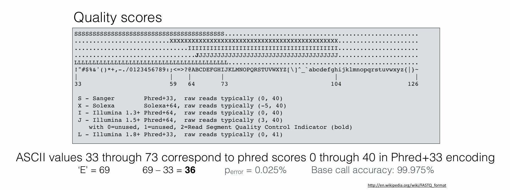

# Demultiplexing Notebook
## Data exploration

all fastq files were found here on talapas: /projects/bgmp/shared/2017_sequencing

| File name | label | Read length | Phred encoding |
|---|---|---|---|
| 1294_S1_L008_R1_001.fastq.gz |Read 1|101bp|Phred 33|
| 1294_S1_L008_R2_001.fastq.gz |Index 1|8bp|Phred 33|
| 1294_S1_L008_R3_001.fastq.gz |Index 2|8bp|Phred 33|
| 1294_S1_L008_R4_001.fastq.gz |Read 2|101bp|Phred 33|

Check the read lengths for each file:
example - Read 4 file
```
 zcat 1294_S1_L008_R4_001.fastq.gz | head -2 | tail -1 | wc
 ```
Output: 102 characters, but 1 character is a new line character so 101bp

Check Phred encoding:
All files contain "#" as a quality score characters, which is exclusive to phred 33.

However, I also noticed that several reads at the beginning of the file had quality scores that start with "#", which is a really low quality score for phred 33...

Loked later in the file to see if scores seem to improve:
```
zcat 1294_S1_L008_R4_001.fastq.gz | head -1000000 | tail -12
```
Here are some of the quality scores with that first character improved:
```
AAFAFJJJJJJJJJJJJFFFJJFFJJJJJJJJAJFJFJJFJJJJJJJJJJJJJJJJJJJJFFJJJJJJJJJJ7-FJJJJJJJJJJJJJJJJJJJJJJJJJJ

<A-A----<---<---------F----<---<--7--<-<--7<------7-----7----77--------7--<-7A<F---7--7--77A-7-7---77

AAAFFAFJJFFAFJAFJF-F<FJJJJJJJJJJJJFFJAJFFFJJJJJJJJJJJJJJJJJFFJJJJJFJJJJJJJAJJJJJJJJJJFFJJJFJJJJJFFJJJ
```

## Make quality score distributions
Histograms can be found here:
1. [Link to Index 1 histogram](/projects/bgmp/mlscha/bioinfo/Bi622/Demultiplex/Assignment-the-first/Index1_dist.png)
2. [Link to Index 2 histogram](Assignment-the-first/Index2_dist.png)
3. [Link to Read 1 histogram](/projects/bgmp/mlscha/bioinfo/Bi622/Demultiplex/Assignment-the-first/Read1_dist.png)
4. [Link to Read 2 histogram](/projects/bgmp/mlscha/bioinfo/Bi622/Demultiplex/Assignment-the-first/Read2_dist.png)

Python script can be found here: /projects/bgmp/mlscha/bioinfo/Bi622/Demultiplex/qscoreDiff.py

Shell script can be found here: /projects/bgmp/mlscha/bioinfo/Bi622/Demultiplex/sbatch_qscorediff.sh

Time and Storage Metrics for qscoreDiff.py
```
Command being timed: "./qscoreDiff.py"
	Percent of CPU this job got: 99%
	Elapsed (wall clock) time (h:mm:ss or m:ss): 2:29:24
	Maximum resident set size (kbytes): 67624
	Exit status: 0
```
Picking a quality score cutoff for the indexes:

A quality score of 32 would be a good quality score cut off. When looking at the index graphs, the earlier base pairs in the index have a lower average quality score around 32. If I pick a value over 32 I might miss the majority of the indexes, but selecting less than 32 might result in keeping low quality data that we cannot be as confident in. 

## Write Demultiplexing Script
Need to change my script idea to include opening all 52 files and leaving them open as I write into them.
